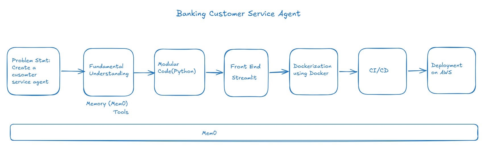

### Project Name: Banking Customer Service Agent 

Objective: Assisting bank customer support agent to resolve user queries with accurate response

Solution Overview: Customer support agent gathers customer context using RAG(knowledge base search), Mem0(persistent customer memory), and LangChain tool calling (CRM/Billing lookups) – then uses an LLM to draft a response the agent can review and send in one click.

System Architecture:

Tech Stack: LangChain, LangGraph, Mem0 (for memory), Vector Store

Issues:

Contact: Venkat Anampudi (venkat.anampudi@outlook.com)